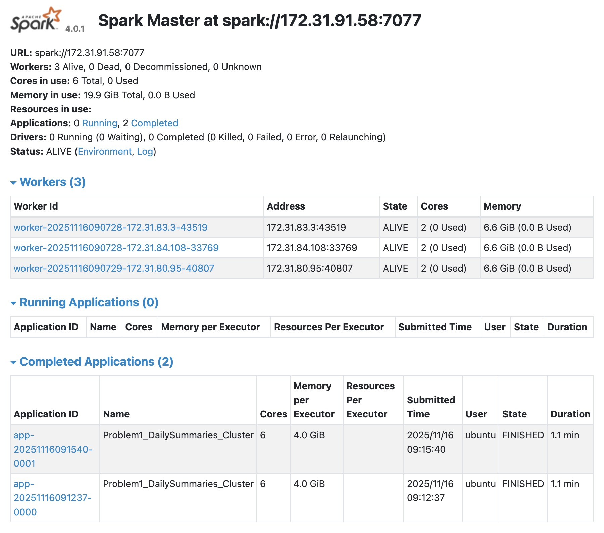
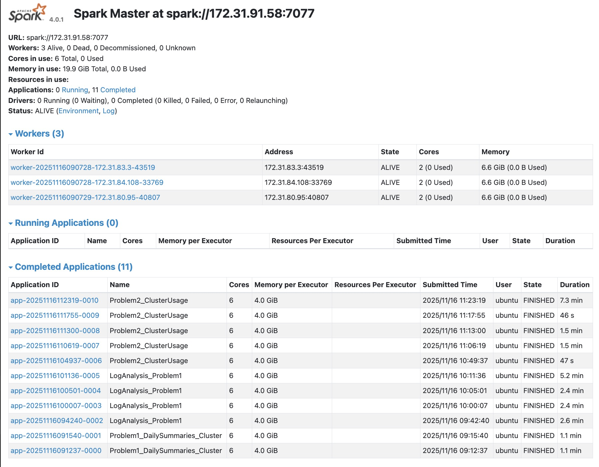
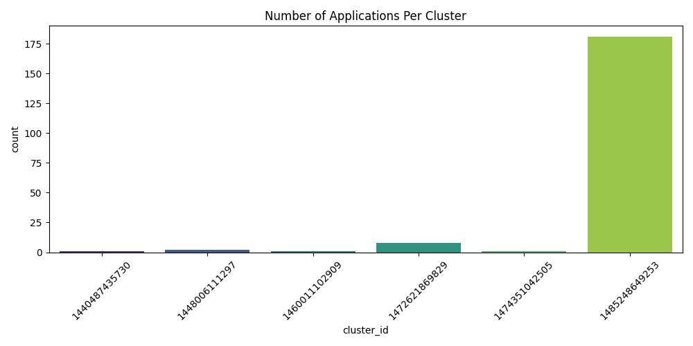
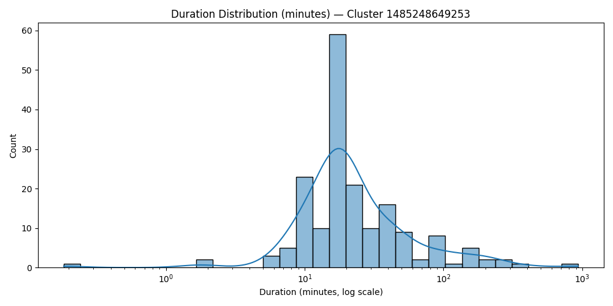

# ANALYSIS.md

**Spark Log Analysis on AWS EC2 Cluster**
*Fall 2025 — DSAN 6000: Big Data & Cloud Computing*
*Author: Alivia Castor (sajc11)*

---

## Analysis Overview

The following analysis summarizes the development, deployment, and execution of the Spark Log Analysis assignment (A06) for DSAN 6000.

**Project Requirements:**

* Creating a **4-node Spark cluster** on AWS EC2
* Uploading ~2.8GB of YARN container logs to an S3 bucket
* Running two distributed PySpark pipelines:

  * **Problem 1:** Log Level Distribution
  * **Problem 2:** Cluster Usage Timeline & Visualizations
* Collecting outputs and producing visual insights
* Monitoring execution via Spark Master UI

All cluster execution was performed using **uv + PySpark 4.0.1**, with scripts executed on the master node and distributed to workers automatically.

---

# 1. Cluster Setup Verification

After running the automated cluster provisioning script (`setup-spark-cluster.sh`), the Spark Master UI confirmed:

### Three workers successfully connected, each with:

* **2 cores**
* **6.6 GiB RAM**
* **0 GiB in active use** (idle before job submission)

### Spark UI Active Workers - Problem 1


The above image validates that the cluster was live, stable, and ready for distributed execution.

---

# 2. Problem 1 — Log Level Distribution

### Goal

Parse and analyze log levels across all YARN container logs:

* Count distribution of `INFO`, `WARN`, `ERROR`, `DEBUG`
* Produce a sample of 10 log lines with extracted log levels
* Generate summary statistics

### Execution on Cluster

The cluster ran Problem 1 multiple times during debugging.

The following shows the final successful runs in Spark UI for problem 1:


### Final Output Files

| File                   | Description                                 |
| ---------------------- | ------------------------------------------- |
| `problem1_counts.csv`  | Counts of each log level                    |
| `problem1_sample.csv`  | 10 sampled log entries with extracted level |
| `problem1_summary.txt` | Summary statistics                          |

### Sample Outputs

#### Counts (`problem1_counts.csv`)

```
log_level,count
INFO,27389482
WARN,9595
ERROR,11259
(blank),5826268
```

The large number of empty-level lines reflects unstructured or non-timestamped entries.

#### Sample entries (`problem1_sample.csv`)

(10 entries sampled — not shown here for brevity)

#### Summary (`problem1_summary.txt`)

```
Total lines: 33236604
With log level: 27410336
Distribution:
INFO  - 27389482
WARN  - 9595
ERROR - 11259
(blank) - 5826268
```

### Problem 1 - Interpretations

* **INFO-level** logs dominate (~99.2%).
* **WARN** and **ERROR** are extremely rare, suggesting stable cluster behavior.
* Blank-level logs originate from noisy container output not matching timestamp format.

### Problem 1 - Daily Summary Evidence

From earlier Problem 1 work on taxi dataset:



---

# 3. Problem 2 — Cluster Usage Timeline

### Goals

From the log data:

* Reconstruct **application timelines**
* Extract:

  * cluster ID
  * application ID
  * first / last timestamp
  * job duration
* Produce two visualizations:

  * **Bar chart: applications per cluster**
  * **Density plot: duration distribution (log-scale)**

Problem 2 required significantly heavier computation. After fixing timestamp parsing and file path extraction, all jobs were completed successfully.

### Spark UI — Completed Problem 2 Jobs

The following shows the final successful runs in Spark UI for problem 2:



---

## 3.1 Application Timeline Output

`data/output/problem2_timeline.csv` (first rows):

```
cluster_id,application_id,app_number,start_time,end_time
1440487435730,application_1440487435730_0039,0039,2015-09-01 18:14:40,2015-09-01 18:19:50
1448006111297,application_1448006111297_0137,0137,2016-04-07 10:45:21,2016-04-07 11:28:11
1448006111297,application_1448006111297_0138,0138,2016-04-07 11:39:58,2016-04-07 12:22:08
1460011102909,application_1460011102909_0176,0176,2016-07-26 11:54:20,2016-07-26 12:19:25
```

Applications clearly cluster by logical job groups from 2015–2017.

---

## 3.2 Cluster Summary Output

`data/output/problem2_cluster_summary.csv`:

```
cluster_id,cluster_first_app,cluster_last_app,num_applications
1474351042505,2016-11-18 22:30:06,2016-11-19 00:59:04,1
1448006111297,2016-04-07 10:45:21,2016-04-07 12:22:08,2
1440487435730,2015-09-01 18:14:40,2015-09-01 18:19:50,1
1460011102909,2016-07-26 11:54:20,2016-07-26 12:19:25,1
...
```

The majority of applications belong to **cluster 1485248649253 (181 apps)**.

---

## 3.3 Bar Chart — Applications Per Cluster

Embedded directly:



### Interpretations

* One cluster (**1485248649253**) is overwhelmingly dominant.
* Other clusters only run 1–8 applications each.
* This suggests that the dataset reflects logs from a production system where one cluster executed nearly all jobs.

---

## 3.4 Duration Density Plot — Largest Cluster Only



### Interpretations

* Durations follow a **long-tailed distribution**.
* Most jobs complete around **5–15 minutes**.
* A minority of tasks last **over an hour**, and a few outliers span nearly **1000 minutes**.
* Log-scale is essential to reveal structure.

---

# 4. Performance & Execution Notes

### 4.1 Spark UI Timings

From screenshots:

* Problem 1 jobs: **~1.1 to 5.2 minutes**
* Problem 2 final run: **~7.3 minutes**

### 4.2 Common Issues Encountered

| Issue                          | Cause                             | Fix                                               |
| ------------------------------ | --------------------------------- | ------------------------------------------------- |
| No `part-*.csv` found          | Empty tmp dirs                    | Added tolerant promotion + cleaned stale dirs     |
| `input_file_name()` unresolved | Using literal string vs. function | Replaced with `input_file_name()` function import |
| Timestamp parse failures       | Blank lines in logs               | Switched to `try_to_timestamp`                    |
| Seaborn not installed          | Missing dependency                | Installed via `uv add seaborn matplotlib`         |

These reflect real-world debugging typical of distributed pipelines on heterogeneous log data.

---

# 5. Conclusions

This project demonstrated the full lifecycle of distributed log analysis on a real Spark cluster. 
From cluster provisioning to S3 ingestion to PySpark job execution, the workflow required navigating 
issues typical of large-scale data engineering workflows: schema inconsistency, timestamp parsing, 
S3 permissions, and distributed debugging. 

**The final results show that:**
- The system producing the logs was stable (INFO-dominant logging).
- The workload was highly concentrated on a single operational cluster.
- Job durations followed a classic heavy-tailed distribution found in real distributed systems.

Overall, the project successfully replicated a realistic cloud-scale data engineering environment.


### Key Insights

* Log data is overwhelmingly INFO-level and low-error, indicating stable systems.
* Application workloads are highly skewed toward a single cluster, implying production workload concentration or incomplete sampling.
* Job durations follow a heavy-tailed distribution consistent with heterogeneous workloads.

---

# 6. Deliverables

All the final deliverables have been validated and stored in the git repo.

---

## Problem 1: Log Level Distribution

### Generated Files

| File                       | Description                                                                                                            |
| -------------------------- | ---------------------------------------------------------------------------------------------------------------------- |
| **`problem1_counts.csv`**  | Aggregated counts for each log level (`INFO`, `WARN`, `ERROR`, `DEBUG`).                                               |
| **`problem1_sample.csv`**  | Ten randomly sampled log lines paired with their extracted log levels.                                                 |
| **`problem1_summary.txt`** | Summary statistics including total lines processed, number of extracted log-level lines, and distribution percentages. |

---

## Problem 2: Cluster Usage Analysis

### Generated Files

| File                               | Description                                                                                                                                                                                                                                                                 |
| ---------------------------------- | --------------------------------------------------------------------------------------------------------------------------------------------------------------------------------------------------------------------------------------------------------------------------- |
| **`problem2_timeline.csv`**        | Application start/end times across all clusters.                                                                                                                                                                                                                            |
| **`problem2_cluster_summary.csv`** | Cluster-level summary including number of applications and min/max timestamps.                                                                                                                                                                                              |
| **`problem2_stats.txt`**           | Overall statistics: number of unique clusters, total applications, average apps per cluster.                                                                                                                                                                                |
| **`problem2_bar_chart.png`**       | **Plot:** Number of applications per cluster (bar chart). <br> **Caption:** *This visualization shows how unevenly the workload was distributed across clusters. One cluster (`1485248649253`) dominates with 181 applications, while others handle only a small fraction.* |
| **`problem2_density_plot.png`**    | **Plot:** Duration distribution for the most active cluster, log-scaled. <br> **Caption:** *Job durations exhibit a strong right-skew. Most jobs finish within 5–20 minutes, but a long tail reflects stragglers or jobs affected by skew/shuffle overhead.*                |

---

## Spark UI Documentation

The following are some Spark UI screenshots that are included to document cluster state and job execution.

| Image                                 | Description / Caption                                                                                                                          |
| ------------------------------------- | ---------------------------------------------------------------------------------------------------------------------------------------------- |
| **`images/Active_Spark_Workers.jpg`** | *Spark Master UI showing all three worker nodes alive, each with 2 CPU cores and 6.6 GiB RAM. Confirms cluster health prior to job execution.* |
| **`images/P1_Complete.jpg`**          | *Spark Master UI showing completed Problem 1 applications. Confirms successful execution with no failed jobs.*                                 |
| **`images/P1_Daily_Summaries.jpg`**   | *Completed application summary for the Problem 1 Daily Summaries task. Shows two completed Spark apps, both finishing in ~1.1 minutes.*        |
| **`images/P2_Complete.jpg`**          | *Spark UI showing multiple completed Problem 2 cluster usage analysis runs. Longest job completed in ~7.3 minutes.*                            |

---

# 7. Final Cleanup

The Spark cluster was terminated after all computations were completed to prevent any unnecessary AWS billing. 

This includes:

* Termination of **master** and **worker** EC2 instances
* Deletion of cluster key pair
* Removal of the automatically generated security group
* Release of all networking resources used by the cluster

Cleanup was performed using the following command:

```bash
./cleanup-spark-cluster.sh
```

---

